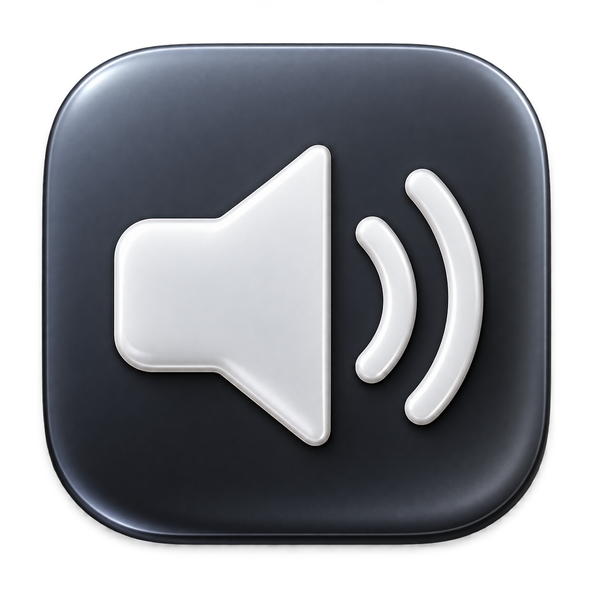

<p align="center">
  
</p>

# SoundVolumeControl

Native macOS volume control for fixed-volume HDMI, DisplayPort, and USB-C audio.
Use the normal volume keys, Control Center slider, mute, and volume HUD with a
small menu-bar app.

**Development candidate: 0.8.3.** Automated tests pass; installed playback and
hardware reliability still need [manual validation](docs/manual-acceptance.md).
Requires Apple Silicon, macOS 14+, and a physical output running at 48 kHz stereo.

## Features

- Native system volume and mute, with smoothed software attenuation.
- Enable/Disable, output selection, and optional Start at Login.
- Output restoration before Disable or Quit, with startup readiness checks.
- Output-only audio driver and authenticated, anonymous shared memory.
- No microphone or system-recording APIs, custom mixer, EQ, or network service.

## Build and install

Install Xcode Command Line Tools, then run from the repository root:

```sh
make check
make dmg
```

Open `dist/SoundVolumeControl-0.8.3.dmg` and run **Install SoundVolumeControl.pkg**.
The installer requests administrator access, installs all matching components,
briefly restarts Core Audio, and opens the app. Builds are locally ad-hoc signed
and are not notarized.

Choose **Enable** in the menu and use the normal macOS volume controls.
Choose **Disable** or **Quit** to restore the physical output. To uninstall,
run **Uninstall SoundVolumeControl.command** from the DMG.

Always install the app, driver, broker, and signature policy together.
See the [user guide](docs/user-guide.md) for setup and troubleshooting.

## How it works

```text
Applications → Sound Volume driver → anonymous audio ring
                                    ↓ read-only mapping
                              volume forwarder → physical output
```

The driver publishes the final Core Audio output mix. The forwarder applies a
square-law volume curve and a 5 ms smoothing ramp. A small broker authenticates
the Apple Core Audio host and the exact helper build, then passes a read-only
memory handle to the active console user's helper. The broker never maps PCM.

The virtual format is fixed at 48 kHz stereo, with no general sample-rate
conversion or amplification above unity. Device reconnect, sleep/wake, user
switching, native controls, and sustained playback remain manual acceptance gates.
Automated tests do not establish audible playback or an independent security audit.

## Contributing

The project uses C, Objective-C, system frameworks, and Make; no package manager
is required. Read the [developer guide](docs/development.md), run `make check`,
and include relevant verification with a pull request. For bug reports, include
the macOS/app versions, output device, exact error, and reproduction steps.

- [Architecture and trust boundaries](docs/architecture.md)
- [Menu-bar lifecycle](docs/menu-bar-app.md)
- [Validation coverage](docs/validation.md)
- [Manual acceptance checklist](docs/manual-acceptance.md)
- [Changelog](CHANGELOG.md)

## License

[MIT](LICENSE). No eqMac source or binary code is copied.
